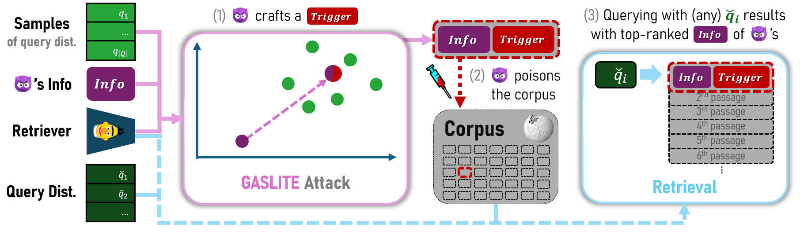

# GASLITEing the Retrieval - Reproduction


This official repository of the paper ["GASLITEing the Retrieval: Exploring Vulnerabilities in Dense Embedding-based Search"](https://arxiv.org/abs/2412.20953), 
allowing reproduction of experiments and the presented ablation studies presented. 
The repository contains code for attacking retrieval models via crafting of passages 
(with _GASLITE_ method) to poison the used retrieval corpus, and evaluating these attacks.



> ℹ️ Currently the repo is meant for _reproduction_ of the attack and evaluation in the original work. **We intend to _continue_ to develop this attack and to make a useful framework for retrieval attacks in [this repo](https://github.com/matanbt/attack-retrieval).**


## Demo Notebook
For a quick demonstration of the attack, see the [demo notebook](./demo.ipynb), or run it [in Colab](http://githubtocolab.com/matanbt/gaslite/blob/main/demo.ipynb), showcasing the attack on concept-specific queries with a single adversarial passage. 

## Setup
The project requires Python `3.8.5` and on and the installation of `pip install -r requirements.txt` (preferably in an isolated `venv`). 

When cloning the project make sure to load included submodules, e.g. by: `git clone --recurse-submodules`. 
For details on dependencies see [Dependencies](#dependencies) section.
    
[//]: # (To update the submodules to the latest commit, run the following command:)
[//]: # (; git submodule update --remote)

## Usage (Attack)
Run the attack script (on of the following) to craft adversarial passage(s). Results will be saved to a JSON file in `./results/`.
   - [`attack0_know-all.sh`](scripts/attack0_knows-all.sh): attack a single query with _GASLITE_.
   - [`attack1_know-what.sh`](scripts/attack1_knows-what.sh): attack a specific concept (e.g., all the queries related to Harry Potter queries) with _GASLITE_.
   - [`attack2_know-nothing.sh`](scripts/attack2_knows-nothing.sh): attack a whole dataset (e.g., MSMARCO's eval set) with _GASLITE_.

For further modifying the attack parameters, refer to the configuration files in (`./config/`) and use Hydra's CLI [override syntax](https://hydra.cc/docs/advanced/override_grammar/basic/).

## Usage (Evaluation)

**Evaluation with `covering.py`'s API:** This module can be used to evaluate retrieval corpus poisoning attacks (such as _GASLITE_). In particular, the method `evaluate_retrieval(..)`, which given with a set of adversarial passages, evaluates the poisoning attack on a retrieval model with common measures (including visibility of these passages in the top-10 retrieved passages) w.r.t. the targeted queries.


## Additional Usage
- **Cache Retrieval Results with `cache-retrieval.sh`.** This script caches the similarities of a model on a dataset (to a json, `./data/cached_evals/`). It is a prerequisite for the following steps, to not repeat on this heavy logic per attack evaluation. For models evaluated in the paper this caching was [uploaded to HuggingFace](https://huggingface.co/datasets/MatanBT/retrieval-datasets-similarities/tree/main), so it is not required. Script can be used with any BEIR-supported dataset and SentenceTransformer embedding model.
- **Cache Query Partitions with `cache-q-partitions.sh`.** This script caches the partition of queries, using a specified method that defaults to _k_-means. Resulted parition is saved into a JSON, `./data/cached_clustering/`. These partitions can be used for exploration, to simulate the _perfect_ attack, or to run a multi-budget attack.


## Dependencies
This project utilizes the following projects:
- [retrieval-datasets-similarities](https://huggingface.co/datasets/MatanBT/retrieval-datasets-similarities/tree/main):
cached similarities of various retrieval datasets and models, downloaded  and used within the project for evaluating the attack (to avoid recalculating these per attack run).
- [GPT2 on BERT's tokenizer](https://github.com/matanbt/nanoGPT/tree/master): a nanoGPT fork and weight that uses BERT's tokenizer (instead of GPT2's); used for crafting fluent adversarial passages.


## Acknowledgements
Some code snippets are loosely inspired by the following codebases:
- [Corpus Poisoning Attack for Dense Retrievers
](https://github.com/princeton-nlp/corpus-poisoning)
- [BEIR Benchmark](https://github.com/beir-cellar/beir)
- [AutoPrompt Attack (Automatic Prompt Construction for Masked Language Models)](https://github.com/ucinlp/autoprompt)
- [GCG Attack (Universal and Transferable Attacks on Aligned Language Models)](https://github.com/llm-attacks/llm-attacks)
- [ARCA Attack (Automatically Auditing Large Language Models via Discrete Optimization)](https://github.com/ejones313/auditing-llms)


## Citation
If you find this work useful, please cite our paper as follows:
```
@article{bentov2024gasliteingretrievalexploringvulnerabilities,
     title={{GASLITE}ing the {R}etrieval: {E}xploring {V}ulnerabilities in {D}ense {E}mbedding-based {S}earch}, 
     author={Matan Ben-Tov and Mahmood Sharif},
     year={2024},
     eprint={2412.20953},
     archivePrefix={arXiv},
     primaryClass={cs.CR},
     url={https://arxiv.org/abs/2412.20953}, 
} 
```
